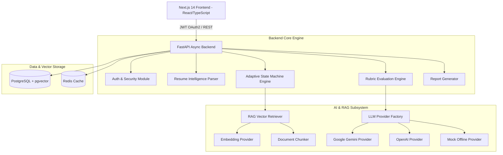

# System Architecture Specification — AI Interviewer Platform

## 1. Executive System Overview
The **AI Interviewer Platform** is a full-stack, enterprise-grade software platform designed for university placement cells, candidates, and technical interviewers. Unlike basic LLM wrappers or chatbots, the platform implements a modular architecture that combines deterministic backend control, Retrieval-Augmented Generation (RAG), resume intelligence parsing, and multi-dimensional rubric scoring.

## 2. Core Architectural Pillars

### 2.1 Deterministic Authoritative Control
- **Timer Control**: The backend owns the authoritative interview countdown timer (`InterviewState.time_remaining_seconds`). The frontend display is strictly view-only.
- **Interview Progression**: Interview stages (`intro` -> `core` -> `deep_dive` -> `wrapup`), question counts, and difficulty levels (`easy`, `medium`, `hard`) are calculated by the Python `AdaptiveStateMachine` based on empirical scoring thresholds.
- **Weighted Rubric Scoring**: Scores are calculated deterministically using weighted linear combinations rather than relying on unstructured LLM outputs.

### 2.2 Provider Abstraction Layer
All external AI capabilities (LLM, Embeddings, STT, TTS) inherit from Abstract Base Classes (`LLMProvider`, `EmbeddingProvider`, `STTProvider`, `TTSProvider`). This enables:
1. Zero-dependency offline demo capability via `MockLLMProvider`.
2. Instant provider switching between Google Gemini, OpenAI, and local models via `.env` configuration without code modification.

### 2.3 RAG Knowledge Retrieval Pipeline
To ensure company-grounded questioning without hallucination:
1. Job descriptions and career pages are crawled and cleaned.
2. Text is split into sliding window chunks (200 words, 30 word overlap).
3. Chunks are embedded into vector space and indexed in PostgreSQL via `pgvector`.
4. During question selection, metadata-filtered cosine similarity search (`company_id`, `role_id`) retrieves top relevant context fragments.

### 2.4 Ethical AI Boundaries
- **No Facial Emotion Scoring**: Facial emotion recognition and appearance are explicitly prohibited from influencing hiring or technical scores.
- **Explicit Consent**: Video/Audio streams require candidate permission before stream initialization.
